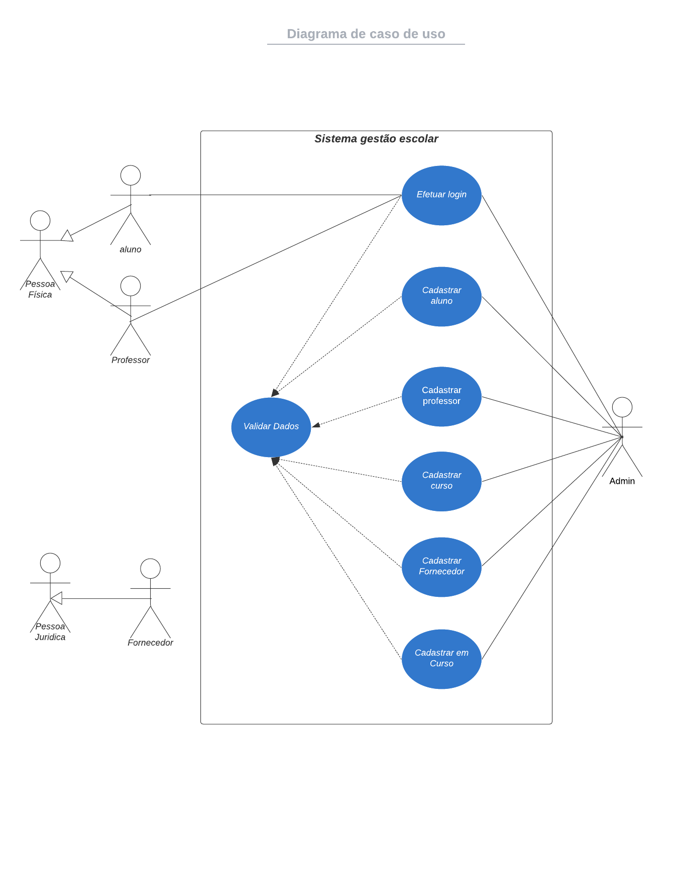
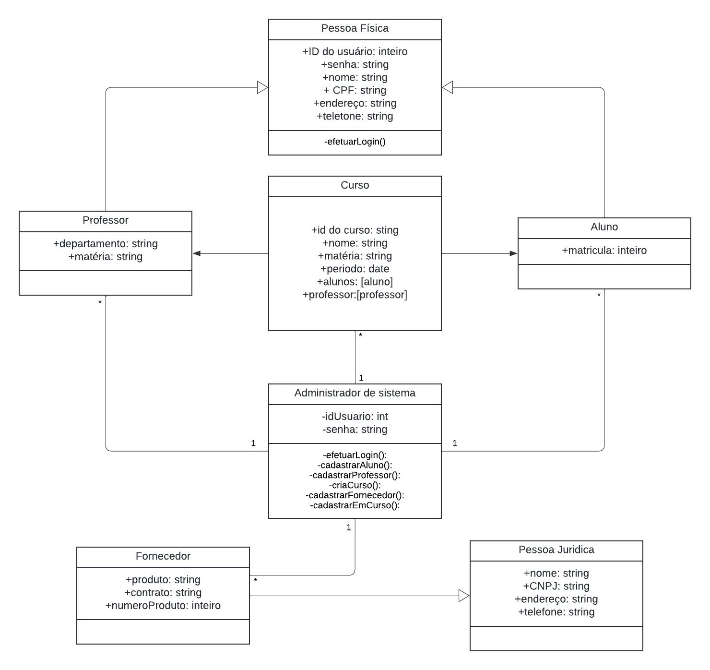
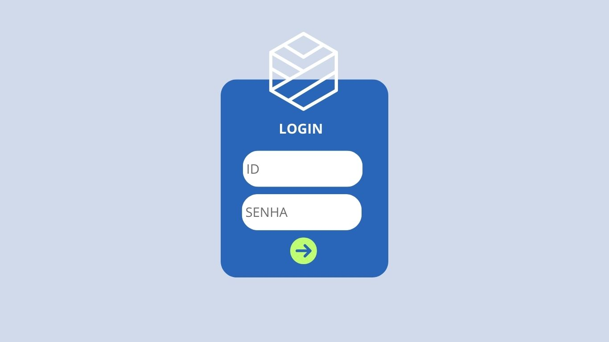
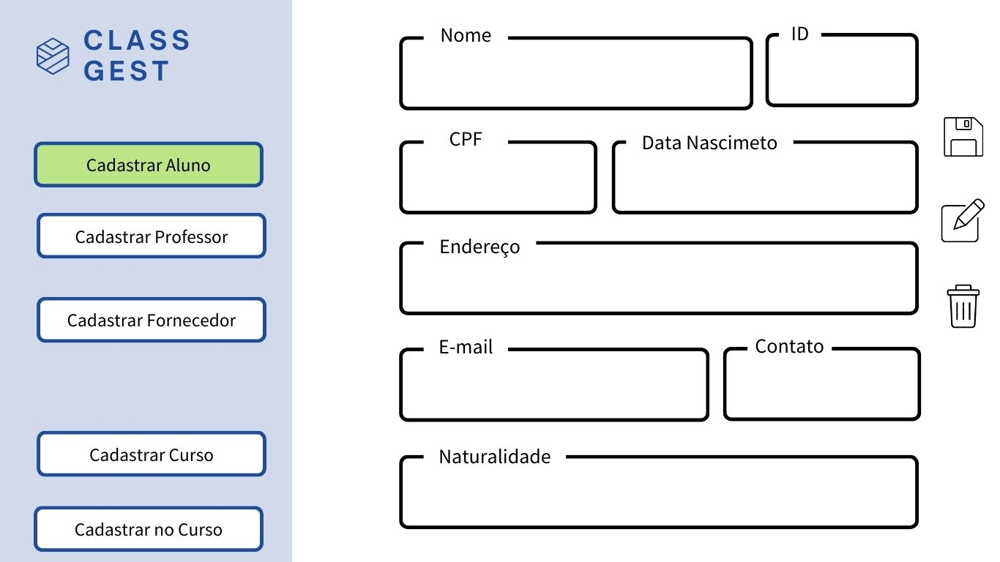
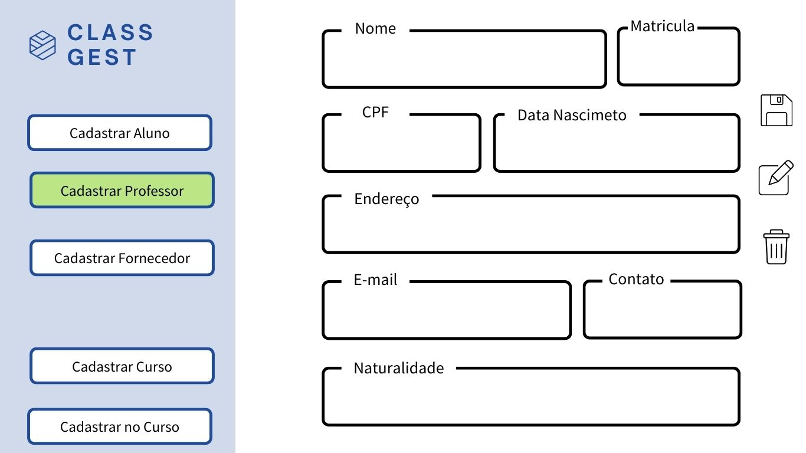
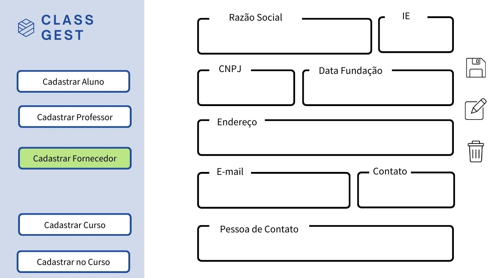
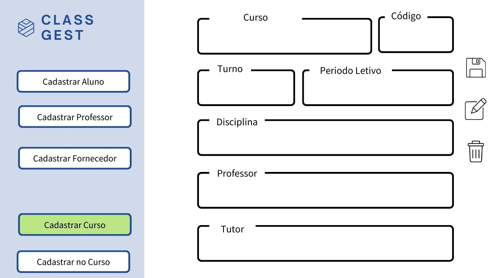
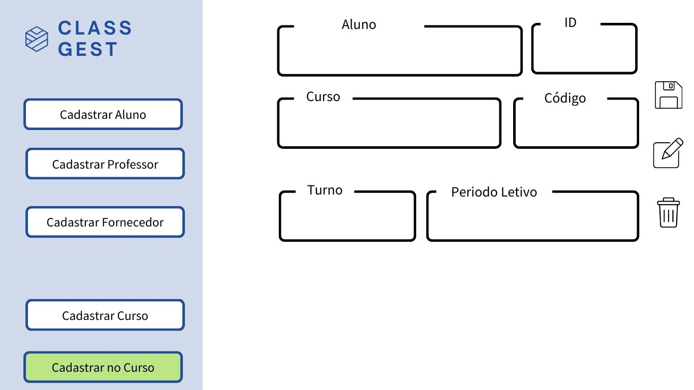
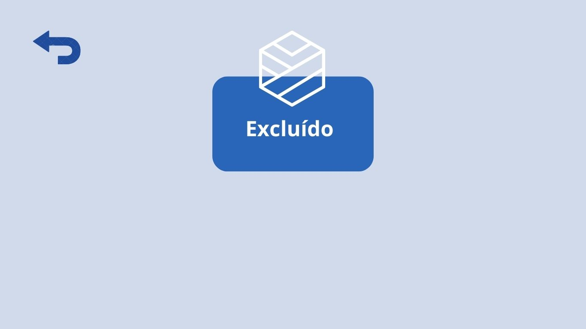
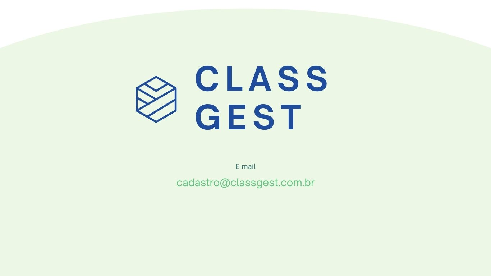

# Sistema de Gestão Escolar

## Projeto Integrador: Desenvolvimento de Sistemas Orientado a Objetos

Este projeto tem como objetivo o desenvolvimento de um **sistema de gestão escolar** que permite o cadastro e a gestão de alunos, professores, fornecedores e cursos. O sistema foi modelado utilizando técnicas de **orientação a objetos** e implementado com base em diagramas de casos de uso e diagramas de classes.

### Integrantes do Grupo
- [Cleber Alves Guedes](https://github.com/PebiAlves) 
- [David Marão Spungin](https://github.com/keldeo05)
- [Eduardo Castro Sakai](https://github.com/duduzinanalise)
- [Isabel Helena Hartmann](https://github.com/belhartmann) 
- [João Henrique Rocha Camargo](https://github.com/Joaohrc11)
- [Luany Beatriz André de Oliveira](https://github.com/luanyoliveira16)

### Orientador
- Enoque Felipe dos Santos Leal

## Descrição do Projeto

O sistema de gestão escolar foi desenvolvido para facilitar o gerenciamento de:
- **Alunos**: Cadastro de alunos, verificação de matrículas e gestão de dados.
- **Professores**: Cadastro de professores, alocação em disciplinas e departamentos.
- **Cursos**: Gerenciamento dos cursos oferecidos pela instituição, com a possibilidade de inscrição de alunos e professores.
- **Fornecedores**: Cadastro de fornecedores responsáveis por materiais e serviços para a instituição.

### Funcionalidades Principais
1. **Efetuar login**: Validação do usuário e controle de acesso.
2. **Cadastro de Aluno**: Registro de novos alunos no sistema.
3. **Cadastro de Professor**: Inclusão de novos professores no sistema.
4. **Cadastro de Curso**: Criação de novos cursos e disciplinas.
5. **Cadastro de Fornecedor**: Gerenciamento de fornecedores e suas informações.
6. **Cadastrar em Curso**: Inscrição de alunos e professores em cursos.

### Diagramas
- **Diagrama de Casos de Uso**: Mostra as interações entre os diferentes atores do sistema (administradores, professores, alunos e fornecedores) e as funcionalidades oferecidas.
- **Diagrama de Classes**: Representa a arquitetura do sistema, destacando classes, atributos, métodos e os relacionamentos entre elas.

### Requisitos
- Pré-condições: O usuário precisa ter um login válido para acessar o sistema e realizar as operações de cadastro.

### Tecnologias Utilizadas
- [Protótipo](https://www.canva.com/design/DAGQH0Htum0/B5gO_JWFvjrchiEvGczq-Q/edit?utm_content=DAGQH0Htum0&utm_campaign=designshare&utm_medium=link2&utm_source=sharebutton)
- [Diagramas](https://www.lucidchart.com/pages/pt)
- [VSCode](https://code.visualstudio.com/)
- [Github](https://github.com/luanyoliveira16/ClassGest)

### Diagrama de casos de uso

### Diagrama de classes

### Tela inicial

### Tela informações nossa empresa

### Tela de login do administrador

### Tela cadastro do aluno

### Tela cadastro do professor

### Tela cadastro do fornecero

### Tela cadastro do curso

### Tela cadastro do no curso

### Tela de cadastro salvo com sucesso

### Tela de cadastro excluido com sucesso

### Tela de contato

